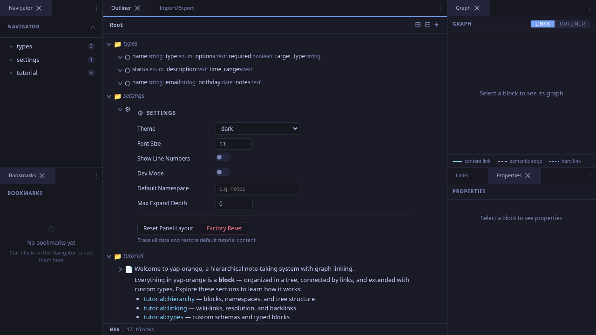
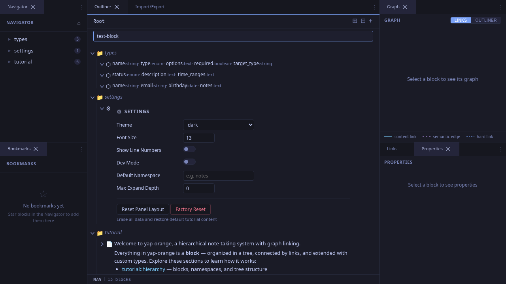

# Creating Blocks

Blocks are the fundamental unit of content in yap-orange. This workflow shows how to create new blocks using the web UI.

## Quick-Create from the Outliner Header

The fastest way to create a block is using the **+** button in the outliner header.

### Step 1: Click the + Button

The outliner header (top of the center panel) has a **+** button. Click it to open the quick-create input.

### Step 2: Type a Name

A text input appears at the top of the outliner. Type the name for your new block.

### Step 3: Press Enter

Press **Enter** to create the block. It appears immediately in the outliner as a child of the current namespace. Press **Escape** instead to cancel.

The new block is created at the root level if you're at the home view, or as a child of the currently centered block if you're navigated into a namespace.

## Creating Blocks from Edit Mode

While editing a block's content, press **Enter** to save the current block and create a new sibling immediately below it. The new block gets an auto-generated timestamp name and the editor jumps to it automatically. This makes rapid note-taking feel fluid -- you never need to leave the keyboard.

See [Keyboard-Driven Editing](./keyboard-editing.md) for details on this flow.

## Tips

- **Naming convention**: Block names form the namespace path (e.g., `research::ml::attention`), so keep them short and descriptive.
- **Empty blocks as containers**: Create a block with no content to use it as a namespace/container. It will show a folder icon and auto-expand to reveal its children.
- **Position**: New blocks are appended after the last sibling. You can reorder them later via drag-and-drop or indent/outdent.
