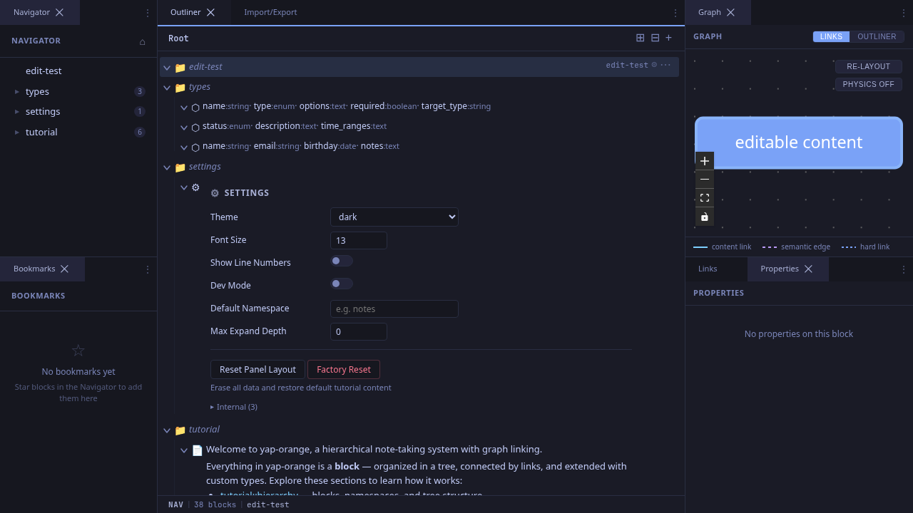
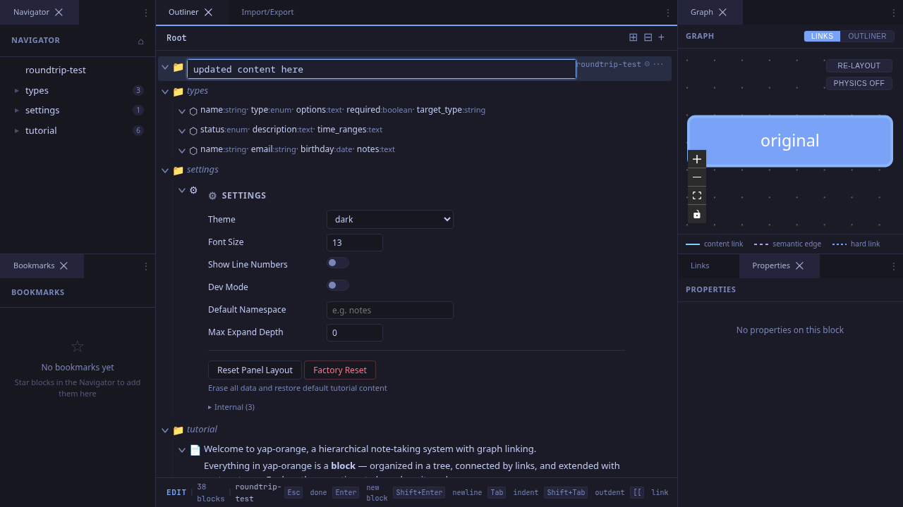
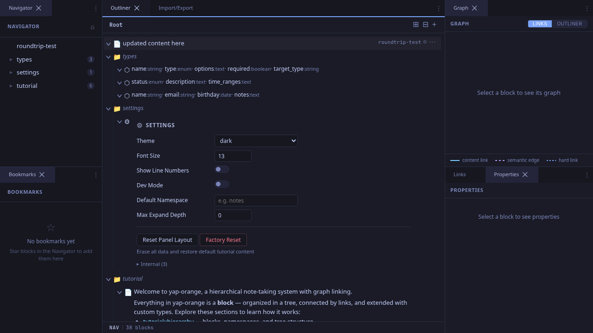
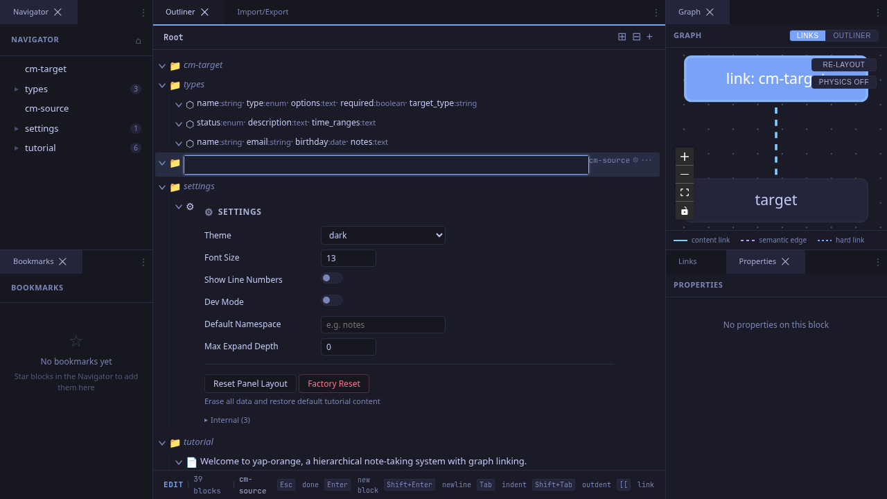
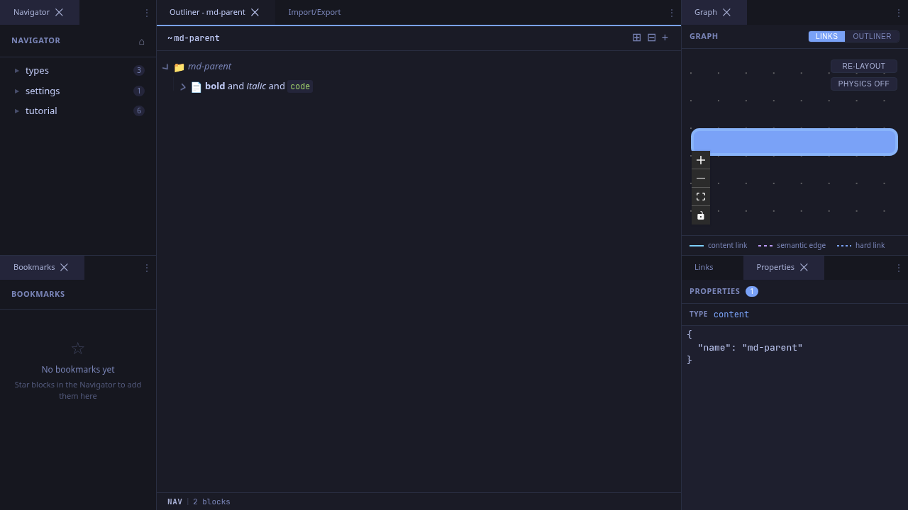
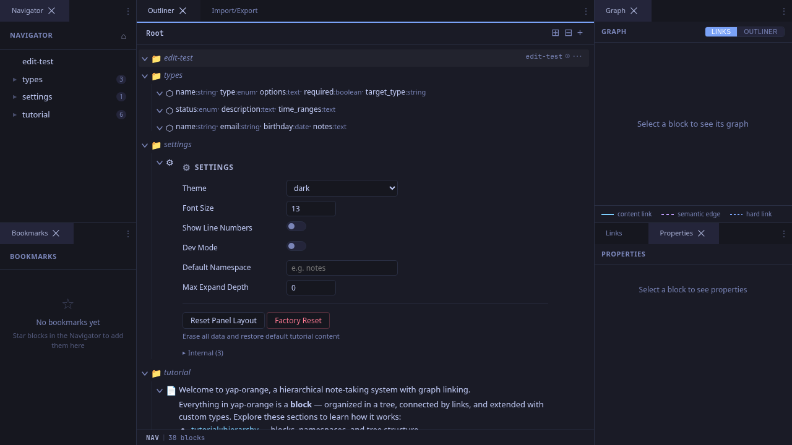

# Editing Content

Each block can hold text content with wiki links and markdown formatting. This workflow covers the edit/display mode cycle.

## Entering Edit Mode

There are two ways to start editing a block:

1. **Click** on the block's content area in the outliner.
2. **Select** the block (click its icon) and press **Enter**.

### Step 1: Select a Block in NAV Mode

Click the block's icon (left side of the row) to select it. The status bar shows **NAV** mode.

### Step 2: Press Enter to Edit

Press **Enter** to switch to edit mode. A CodeMirror 6 editor appears with a highlighted border. The status bar switches to **EDIT** mode.

The editor provides:
- Markdown syntax highlighting
- Wiki-link autocomplete (type `[[`)
- Cursor-aware decorations (wiki links show styled text when your cursor is away, raw syntax when inside)

### Step 3: Type and Save

Type your content in the editor.

Press **Escape** or **Ctrl+Enter** to save and return to navigation mode. The content is rendered through the display pipeline.

## Saving Content

Content is auto-saved whenever you leave edit mode. All these actions trigger a save:

| Action | What Happens |
|--------|--------------|
| **Escape** | Save and return to NAV mode |
| **Ctrl/Cmd+Enter** | Save and return to NAV mode |
| **Click away** | Auto-save on blur |
| **Enter** | Save and create a new sibling below |
| **Arrow Up/Down** (at boundary) | Save and move to adjacent block |
| **Tab / Shift+Tab** | Save and indent/outdent |

## Wiki Links

Wiki links (`[[target]]`) are styled specially in the editor. When your cursor is away from a link, it shows as a decorated widget. When your cursor moves inside, the raw `[[path]]` syntax is revealed for editing.

## Markdown Rendering

Content supports markdown formatting. Bold, italic, code, and other markdown syntax is rendered in display mode.

## After Saving

The editor disappears and the block returns to display mode. The status bar shows **NAV** again.

## Tips

- **Shift+Enter** inserts a newline within a block (since plain Enter creates a new sibling).
- **Content is immutable**: Under the hood, each save creates a new atom (content snapshot). The lineage system tracks the history, so content is never truly lost.
- **Empty blocks**: Blocks with no content show their name in muted italic text and display a folder icon. They're useful as namespace containers.
