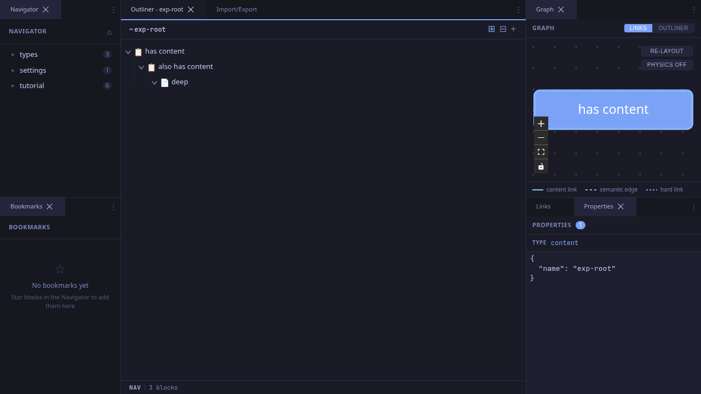
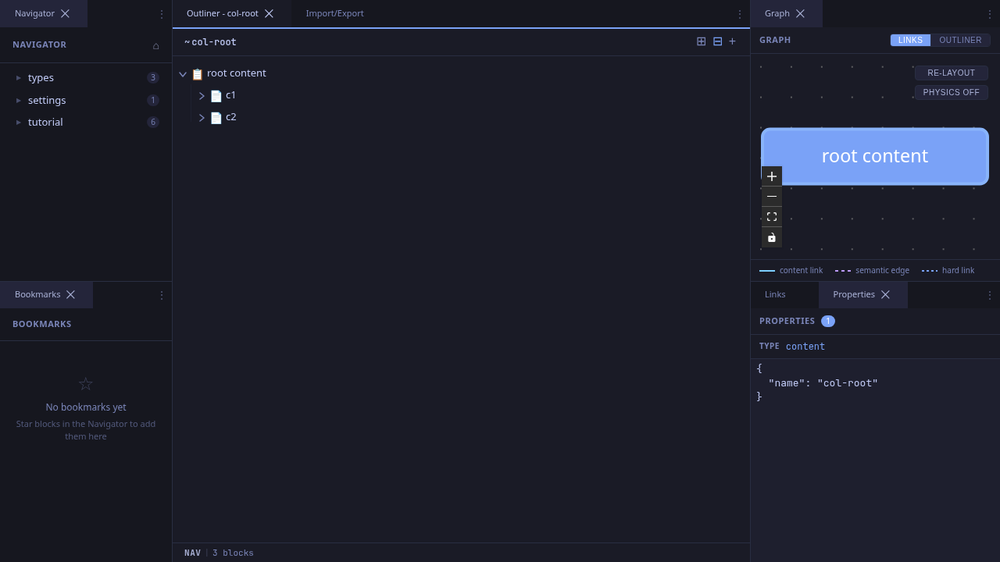
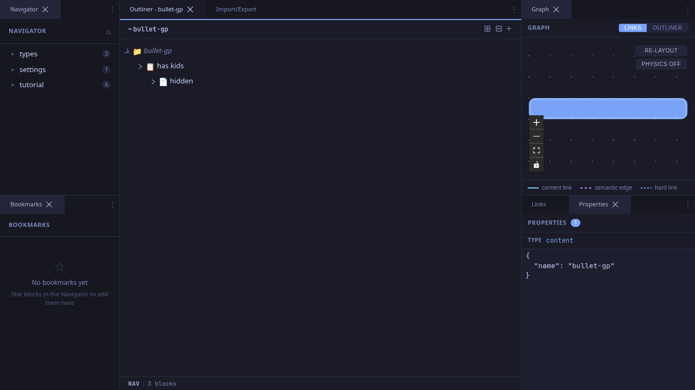

# Expanding and Collapsing

The outliner uses a tree view where blocks can be expanded to show children or collapsed to hide them. This workflow covers the expand/collapse controls.

## Expand All

Click the **Expand all** button (⊞) in the outliner header to recursively expand every block in the current view.

### Before Expand All

Blocks with children show a triangle indicator but their children are hidden.

### After Expand All

All levels of the tree are visible, including deeply nested grandchildren.

Expand all loads children lazily as it descends the tree, which may take a moment for deep hierarchies. The `max_expand_depth` setting (in Settings) limits how deep the expansion goes -- set it to 0 for unlimited.

## Collapse All

Click the **Collapse all** button (⊟) to collapse every expanded block. The virtual root (the currently centered block) stays visible, but all its descendants are hidden.

This is useful when you've drilled into a complex hierarchy and want a fresh, clean view.

## Bullet Toggle

Click the **triangle** to the left of any block to toggle its expand/collapse state.

Children are loaded lazily on first expand. Once loaded, toggling is instant.

## Auto-Expand

Blocks with **no text content** (namespace/container blocks) auto-expand on load. This means navigating into a namespace immediately shows its children without any extra clicks.

Blocks with content do not auto-expand -- you must manually expand them or use Expand All.

## Keyboard Expand/Collapse

In navigation mode, you can expand and collapse using arrow keys:

| Key | On Collapsed Block | On Expanded Block |
|-----|-------------------|-------------------|
| **Arrow Right** | Expand | Move to first child |
| **Arrow Left** | Move to parent | Collapse |

This makes it possible to navigate and explore the entire tree purely with the keyboard.

## Persistence

Expand/collapse state is persisted across sessions. When you return to a block you previously expanded, it will still be expanded. This state is stored in the `outliner_expanded` setting.

## Tips

- **Expand before Tab**: If you want to indent a block under a collapsed sibling, the sibling will auto-expand after the indent to show the newly nested child.
- **Status bar count**: The status bar shows the number of visible blocks, which changes as you expand and collapse. This gives you a quick sense of the tree's scope.
