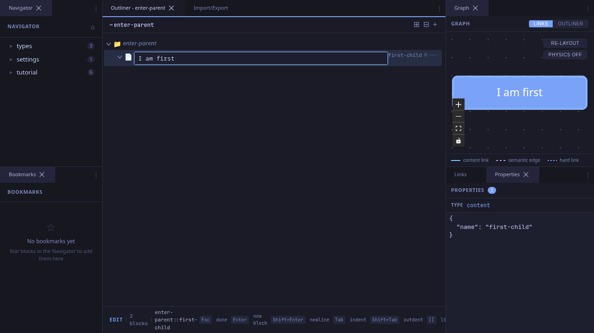
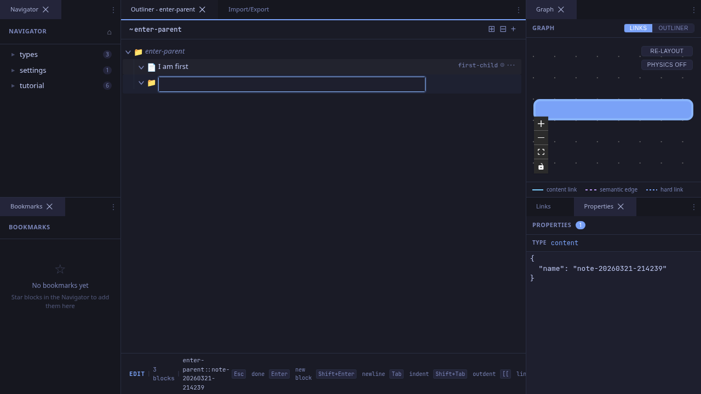
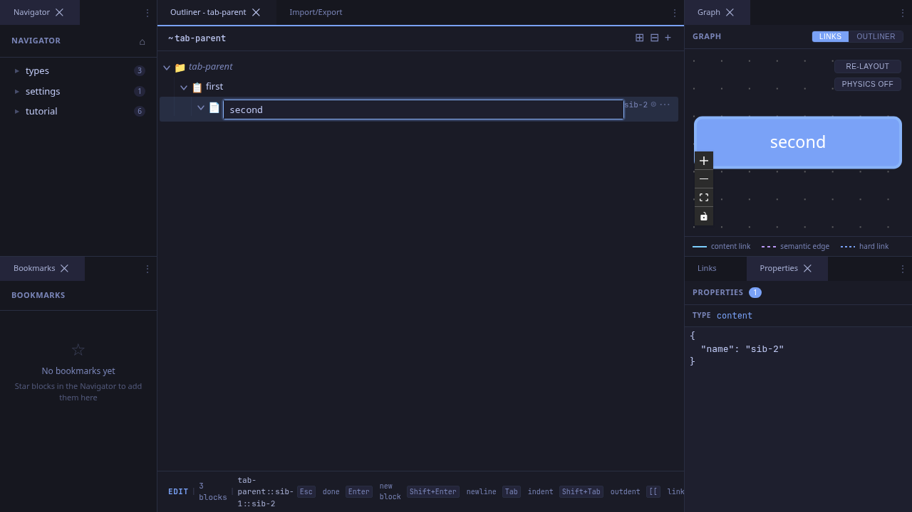

# Keyboard-Driven Editing

The outliner supports a complete keyboard workflow for creating and restructuring blocks without touching the mouse. This workflow demonstrates the key edit-mode keybindings.

## Creating Siblings with Enter

While editing a block, press **Enter** to save the current block and immediately create a new sibling below it.

### Before: Editing a Block

You're editing content in a block. The cursor is in the CodeMirror editor.

### After: New Sibling Created

After pressing **Enter**, the current block is saved and a new empty block appears below it. The editor jumps to the new block automatically.

The new block is positioned between the current block and the next sibling using fractional indexing, so existing order is preserved.

## Indenting with Tab

While editing a block, press **Tab** to save and indent the block under its previous sibling. This is how you build hierarchy without drag-and-drop.

The block is reparented: its `parent_id` changes from the current parent to the previous sibling. The block remains in edit mode so you can keep typing.

## Outdenting with Shift+Tab

Press **Shift+Tab** to move the block up one level in the hierarchy (outdent). The block becomes a sibling of its former parent, positioned right after it.

## Navigating Between Blocks

While editing, the arrow keys can move you between blocks:

| Key | When | Action |
|-----|------|--------|
| **Arrow Up** | Cursor on first line | Save and edit previous block |
| **Arrow Down** | Cursor on last line | Save and edit next block |
| **Arrow Up/Down** | Cursor in middle of multi-line content | Move cursor within editor (normal behavior) |

This makes it feel like one continuous document -- you can arrow up and down through blocks as naturally as through lines in a text editor.

## Full Keybinding Reference

| Key | Action |
|-----|--------|
| `Enter` | Save and create new sibling below |
| `Shift+Enter` | Insert a newline |
| `Tab` | Save and indent (reparent under previous sibling) |
| `Shift+Tab` | Save and outdent (reparent under grandparent) |
| `Escape` | Save and return to NAV mode |
| `Ctrl/Cmd+Enter` | Save and return to NAV mode |
| `Arrow Up` (line 1) | Save and edit previous block |
| `Arrow Down` (last line) | Save and edit next block |

## Tips

- **Rapid outlining**: The Enter → type → Enter → type flow lets you build a flat list quickly. Then use Tab to indent items into sub-groups.
- **Restructure in place**: Tab and Shift+Tab work in both edit mode and nav mode, so you can restructure your outline without leaving the keyboard.
- **The editor remembers**: When you arrow into a block, the cursor is placed at the end by default. Press Ctrl+Home to jump to the beginning.
