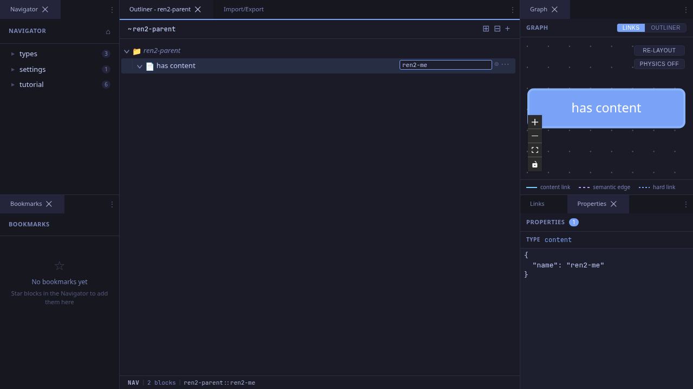
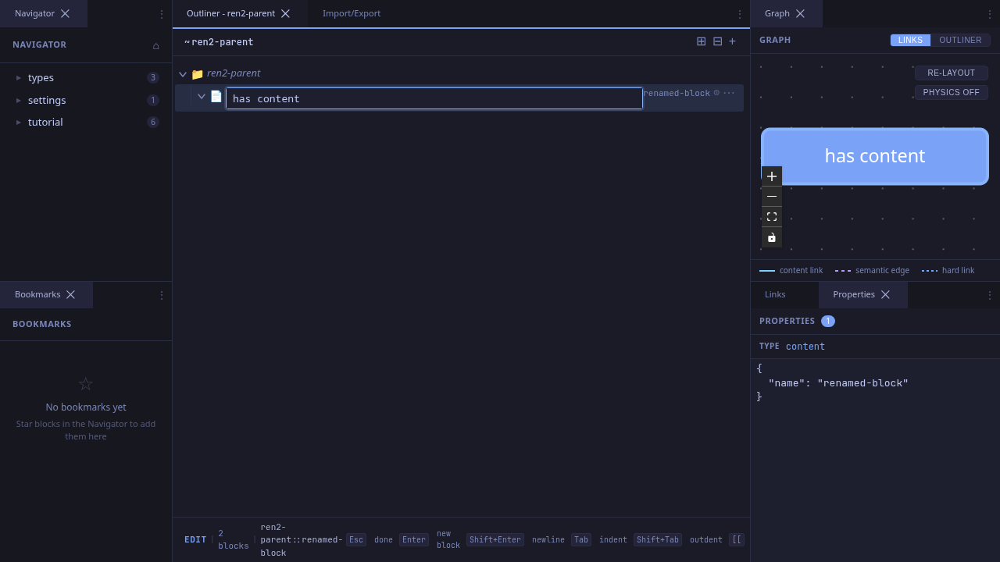
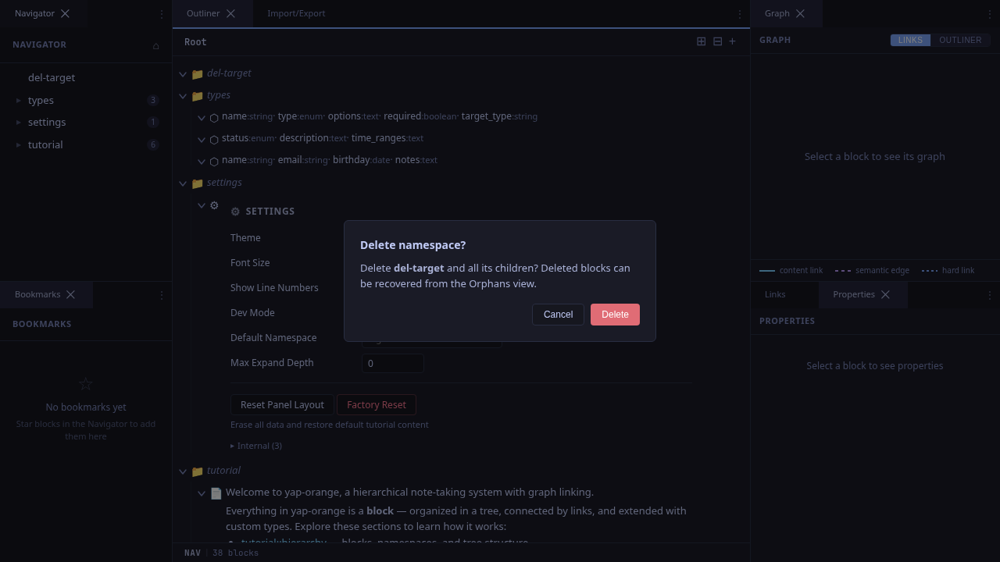
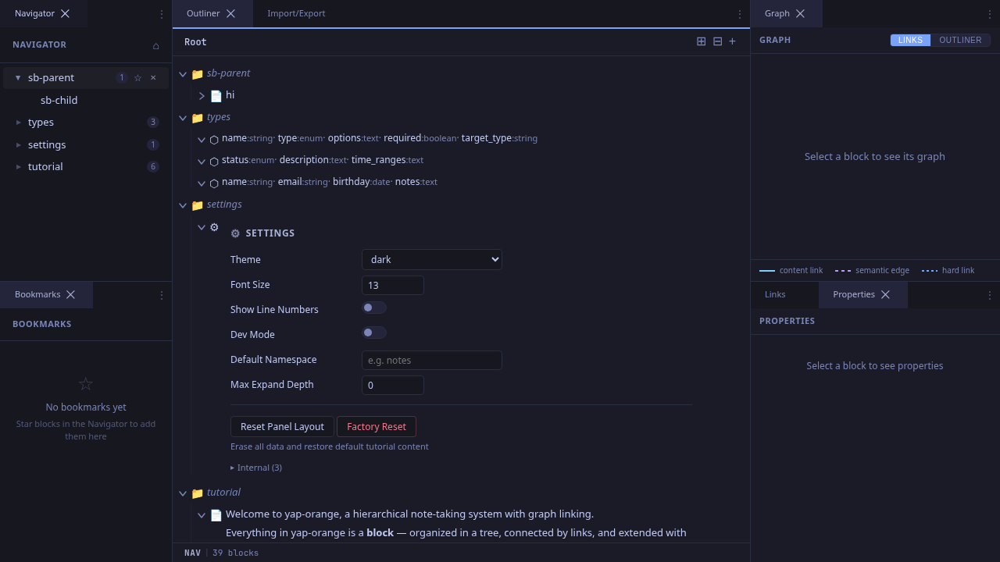

# Managing Blocks

Beyond editing content, you'll often need to rename, delete, and manage blocks through the sidebar. This workflow covers those operations.

## Inline Rename

Double-click on a block's name (the muted text at the right of the row, or the italic name on empty blocks) to open an inline rename input.

Type the new name and press **Enter** to confirm, or **Escape** to cancel without saving.

### Header Rename

When centered on a block, you can also click the block's name in the breadcrumb header to rename it. This is convenient when you're already navigated into the block.

## Deleting Blocks

### From the Sidebar

Hover over a block in the sidebar to reveal the delete button (X icon). Click it to open a confirmation dialog.

Click **Delete** to confirm or **Cancel** to abort. Deleted blocks are soft-deleted -- they can be recovered from the Orphans view.

### From the Keyboard

In nav mode, select a block and press **Delete** to remove it. No confirmation modal is shown for keyboard deletes, so be careful.

## Sidebar Expand/Collapse

The sidebar tree supports its own expand/collapse, independent of the outliner.

Click the triangle next to a block in the sidebar to reveal its children. Children are loaded lazily on first expand. This lets you browse the tree structure without changing the outliner view.

## Sidebar Bookmarks

Hover over a block in the sidebar to reveal a star icon (☆). Click it to bookmark the block. Bookmarked blocks show a filled star (★) and can be filtered to show only bookmarks.

## Tips

- **Rename propagates**: When you rename a block, all wiki links that reference it by namespace path will still resolve correctly because links target the lineage ID, not the name. However, human-readable link text may become stale until you re-save blocks that reference the old name.
- **Soft deletes**: Deleting a block doesn't destroy data. The block and its descendants are soft-deleted (marked with a `deleted_at` timestamp). You can recover them from the Orphans view.
- **Sidebar vs outliner**: The sidebar shows the global tree from the root. The outliner shows the subtree of the currently centered block. They're complementary views into the same data.
