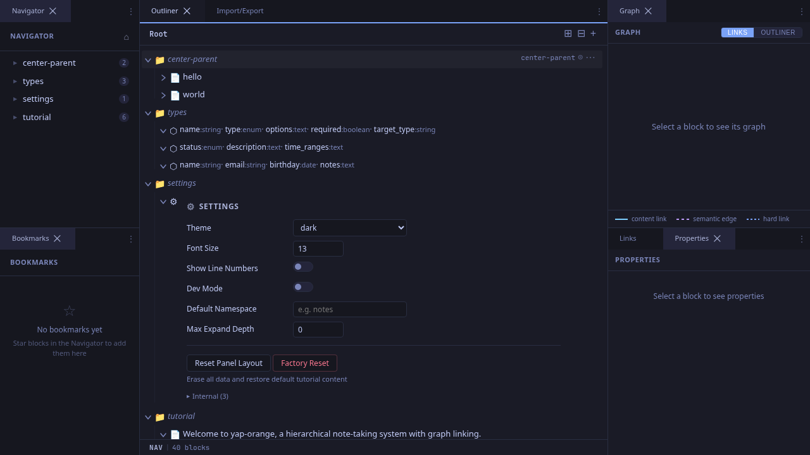
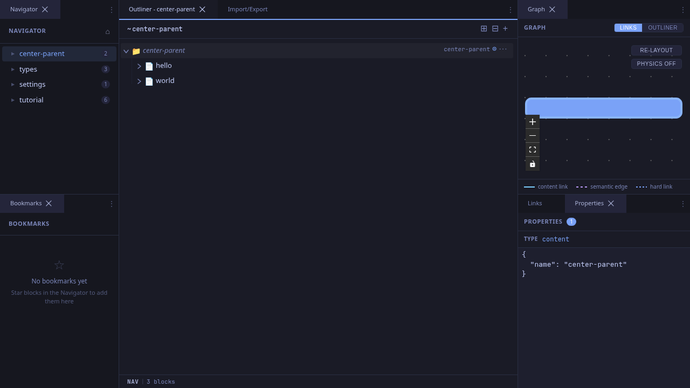
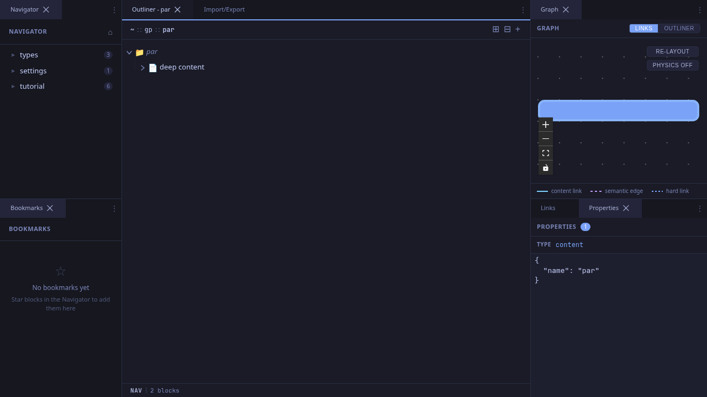
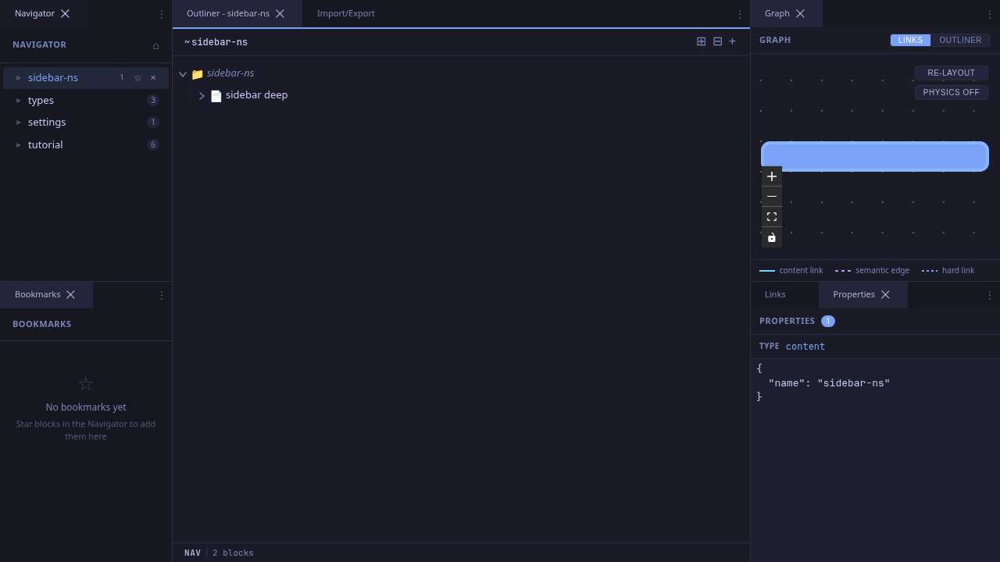

# Navigating the Hierarchy

yap-orange stores notes in a tree hierarchy. This workflow covers the main ways to move through that tree.

## Centering on a Block

"Centering" means making a block the root of the outliner view. Its children appear below it, and the breadcrumb trail updates to show your position.

### Step 1: Hover to Reveal the Center Button

Hover over any block row in the outliner. A target icon appears at the right edge of the row.

### Step 2: Click to Center

Click the target icon. The outliner now shows that block as the virtual root, with its children indented below. The breadcrumb trail in the header updates to show the path.

## Using Breadcrumbs

The breadcrumb trail at the top of the outliner shows the path from root to the current block. Each segment is clickable.

- Click any ancestor in the breadcrumb to jump up to that level.
- Click the **~** at the start to return to the root (home) view.
- Click the current block's name (the last segment) to rename it.

## Sidebar Navigation

The sidebar (left panel) shows the top-level block tree. Click any block to navigate into it.

The currently navigated block is highlighted with an active state. The sidebar also supports:

- **Expand/collapse**: Click the triangle to reveal children without navigating.
- **Child count badges**: Blocks with children show a count next to their name.
- **Home button**: The house icon in the sidebar header returns to the root view.

## URL Routing

The URL bar updates as you navigate, using hash-based paths:

| URL | Destination |
|-----|-------------|
| `/#/` | Home (root blocks) |
| `/#/research::ml::attention` | Namespace path |
| `/#/block/<UUID>` | Direct block by ID |

You can share or bookmark these URLs. Browser back/forward buttons work as expected.

## Tips

- **Keyboard shortcut**: In nav mode, press **Arrow Right** on a collapsed block to expand it, or on an expanded block to move into its first child -- a fast way to drill down without the mouse.
- **Deep linking**: Copy the URL from the address bar to link directly to any block. This works across deployment modes (server, desktop, SPA).
