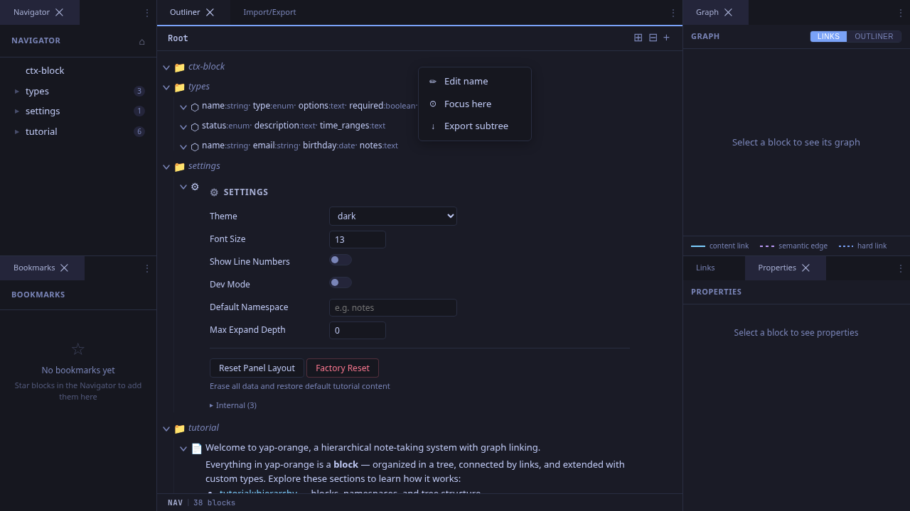
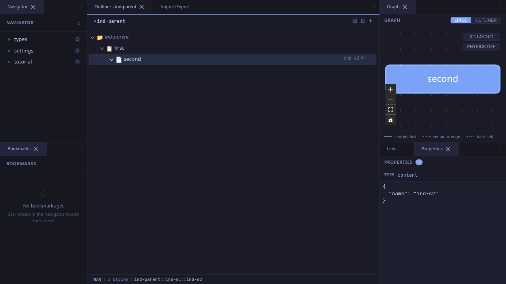
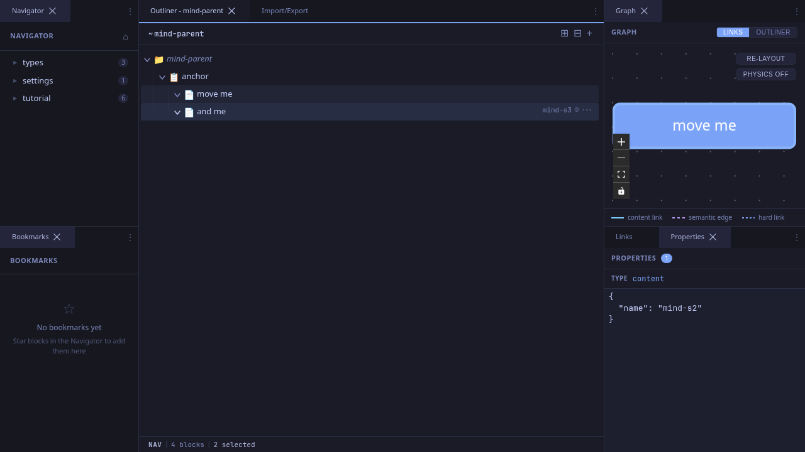

# Organizing Blocks

Once you have blocks, you'll want to restructure them: indent, outdent, reorder, and reparent. This workflow covers the tools for organizing your hierarchy.

## Context Menu

Right-click any block (or click the **...** button that appears on hover) to open the context menu.

The context menu provides actions like:
- **Edit name** -- rename the block inline
- **Focus here** -- navigate into this block (center perspective)
- **Export subtree** -- export this block and all its descendants
- **Delete** -- soft-delete the block (recoverable from Orphans view)

## Indenting in Navigation Mode

Select one or more blocks (see [Selecting Blocks](./selecting-blocks.md)), then press **Tab** to indent them under the previous sibling.

This works exactly like indent in edit mode, but operates on the selected blocks without entering the editor.

## Multi-Block Indent

Select multiple blocks with Ctrl+Click or Shift+Click, then press **Tab**. All selected blocks move together under the same previous sibling.

## Outdenting

Select blocks and press **Shift+Tab** to outdent. Each block moves up one level in the hierarchy, becoming a sibling of its former parent. The block is positioned immediately after its former parent in the sibling order.

## Drag and Drop

Blocks can also be reordered by dragging:

1. **Click and hold** anywhere on a block row to start dragging.
2. **Hover** over a target block. Drop zone indicators appear:
   - **Top quarter** of the row: drop above (insert as sibling before target)
   - **Bottom quarter**: drop below (insert as sibling after target)
   - **Middle half**: drop inside (reparent as child of target)
3. **Release** to complete the move.

Drag-and-drop works with multi-selection: drag any selected block and all selected blocks move together, preserving their relative order.

### Safeguards

- You cannot drop a block onto itself.
- You cannot drop a block onto one of its own descendants (which would create a cycle).
- After a drop, both the old and new parent blocks reload to reflect the change.

## Tips

- **Keyboard is faster**: For quick restructuring, Tab/Shift+Tab is faster than drag-and-drop. Reserve dragging for large moves across distant parts of the tree.
- **Undo via outdent**: If you accidentally indent a block, Shift+Tab immediately reverses it.
- **Focus here from context menu**: When a block has deep nesting, use "Focus here" to center the outliner on it, then reorganize its children with a clear view.
