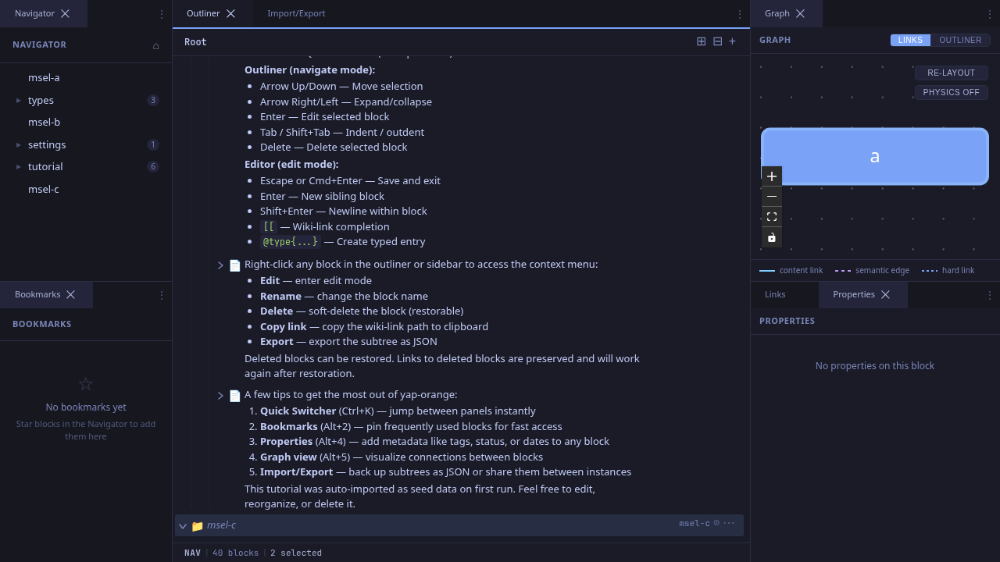
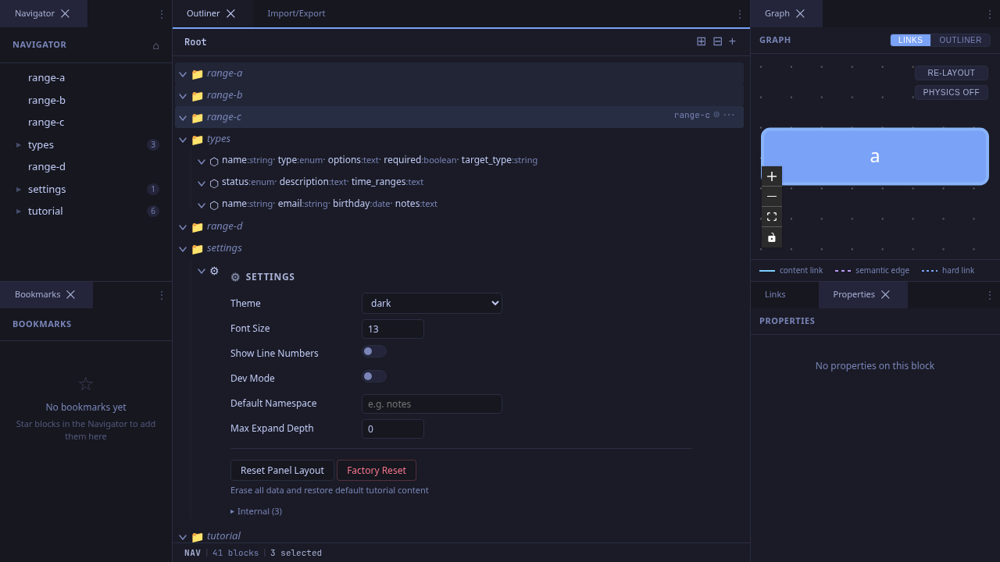
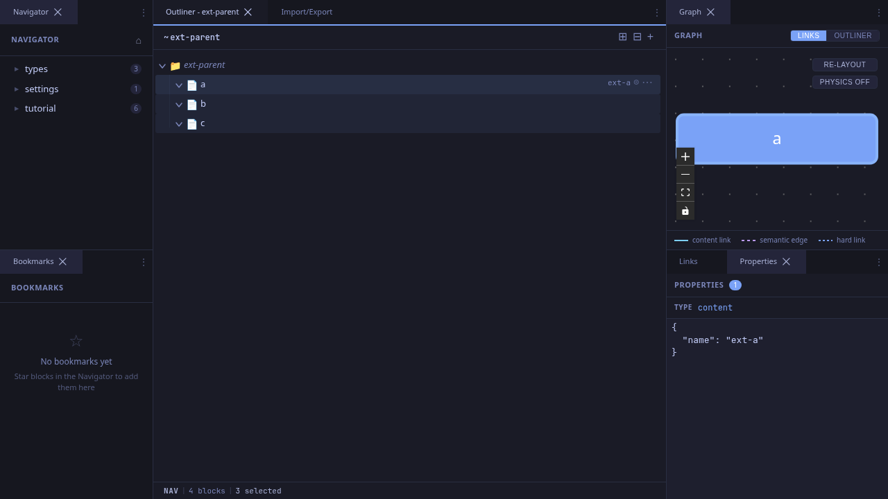

# Selecting Blocks

Selection is the foundation of keyboard-driven navigation. Click a block's icon to select it in NAV mode, then use keyboard shortcuts to edit, move, or multi-select.

## Single Selection

Click a block's **icon** (the small icon to the left of the content) to select it. The block highlights and the status bar shows **NAV** mode. From here you can:

- Press **Enter** to edit
- Press **Arrow keys** to navigate
- Press **Tab** / **Shift+Tab** to indent/outdent
- Press **Delete** to delete
- Press **Escape** to deselect

## Multi-Selection with Ctrl+Click

Hold **Ctrl** (or **Cmd** on macOS) and click additional block icons to add them to the selection. Ctrl+Click on an already-selected block removes it from the selection.

This is useful when you want to operate on non-contiguous blocks -- for example, selecting blocks A and C but not B.

## Range Selection with Shift+Click

Click one block to set the anchor, then **Shift+Click** another block to select the entire contiguous range between them.

## Extending Selection with Shift+Arrow

After selecting a block, hold **Shift** and press **Arrow Down** or **Arrow Up** to extend the selection one block at a time.

This is ideal for quickly selecting a run of adjacent blocks without reaching for the mouse.

## Collapsing Selection

After multi-selecting, a plain click (without modifier keys) on any block icon collapses the selection down to just that block.

## Operations on Multi-Selection

| Action | Effect |
|--------|--------|
| **Tab** | Indent all selected blocks under the previous sibling |
| **Shift+Tab** | Outdent all selected blocks |
| **Delete** | Delete all selected blocks |
| **Drag** | Move all selected blocks together |

## Tips

- **Icon click vs content click**: Clicking the icon selects in NAV mode. Clicking the content area enters EDIT mode. This distinction is intentional -- it lets you precisely control whether you're navigating or editing.
- **Escape clears all**: Press Escape to deselect everything and return to a clean state.
- **Selection persists across keyboard actions**: After Shift+Arrow to select a range, pressing Tab indents the entire range. No need to re-select.
